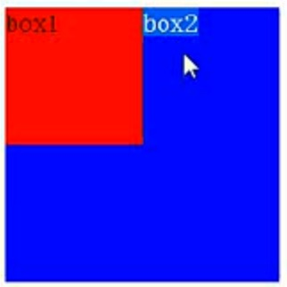

# 7月23日总结

### 选择符优先级

1. 同级样式后者默认覆盖前者

2. 类型越多优先级越高 ul li > li

3. 类型(1) < class(10) < id(100) < style行间样式(1000) < js修改

### css reset

将浏览器一些默认的样式重置，我使用的是normalize.css并在其中加入了自己的改动。

### 伪类

ie6不支持除a标签以外的任何标签的伪类

ie6以上支持所有标签的hover伪类

### display:inline-block

1. ie6,7不支持
2. 换行会被解析

### 浮动补充

	.box1{
		width:100px;
		height:100px;
		float:left;
		background:red;
	}
	.box2{
		width:200px;
		height:200px;
		background:blue;
	}
	
box1

	
box2

	

虽然box1浮动，box2可以占有box1的位置，但是位置仅限box2本身，所以文字被挤出来。提升级只有半层。